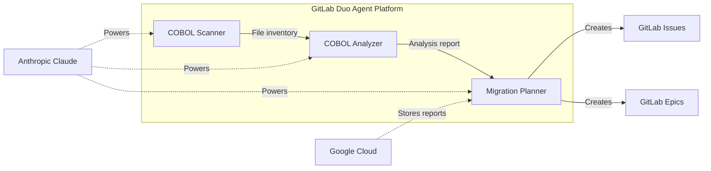

# COBOL Compass 🧭

**AI-powered legacy code modernization agent for GitLab**

> 95% of ATM transactions still run on COBOL. COBOL Compass scans your GitLab repos for legacy COBOL programs, extracts business rules, assesses migration complexity, and generates actionable modernization tickets — all inside GitLab.

Built for the [GitLab AI Hackathon 2026](https://gitlab.devpost.com/) by **Nafees Ahamed** — Mainframe Modernization Specialist with 22+ years of enterprise experience.

---

## The Problem

Enterprises spend over **$100 billion annually** maintaining legacy mainframe systems. The biggest bottleneck in every modernization project: nobody on the team reads COBOL. Teams spend weeks manually analyzing programs, extracting business logic, and writing migration plans before a single line of modern code gets written.

## The Solution

COBOL Compass automates the first 80% of legacy code assessment using three specialized AI agents and one orchestrated flow on the GitLab Duo Agent Platform.

### Agents

| Agent | Purpose | Output |
|-------|---------|--------|
| **COBOL Scanner** | Scans repos for `.cbl`, `.cob`, `.cpy` files | Structured inventory with LOC, dependencies, complexity |
| **COBOL Analyzer** | Deep analysis of individual programs | Business rules, risk flags, complexity rating, migration approach |
| **Migration Planner** | Converts analysis into action items | GitLab epics and issues with labels, estimates, acceptance criteria |

### Flow

**Full Modernization Assessment** — Chains all three agents: Scan → Analyze → Plan. One command produces a complete migration roadmap with real GitLab issues.

## Architecture

## Sample COBOL Programs

The `samples/` directory contains representative COBOL programs of varying complexity:

| Program | Complexity | Dependencies | Description |
|---------|-----------|--------------|-------------|
| `INTEREST-CALC.cbl` | Low | File I/O | Batch compound interest calculator with 3 loan types |
| `ACCT-MGMT.cbl` | Medium | CICS, DB2 | Online account management (inquiry, update, close, transfer) |
| `LOAN-PROCESS.cbl` | High | DB2 Cursors, VSAM, Subprograms | End-of-day loan processing with delinquency escalation |

Copybooks in `samples/copybooks/`:
- `ACCTCPY.cpy` — Account record layout
- `LOANCPY.cpy` — Loan master record layout  
- `PYMTCPY.cpy` — Payment history record layout
- `ERRMSGCP.cpy` — Error message table with REDEFINES

## Technology Stack

- **GitLab Duo Agent Platform** — Custom agents and flows
- **Anthropic Claude** — AI reasoning engine (default in GitLab Duo)
- **Google Cloud** — Assessment report storage
- **COBOL** — Legacy source code analysis target

## How It Uses Anthropic

All agents run on Anthropic's Claude models via GitLab Duo's built-in integration. The system prompts encode deep COBOL domain expertise including:
- COBOL-85/2002 dialect patterns
- CICS transaction processing
- DB2 embedded SQL and cursor handling
- VSAM file organization
- Packed decimal (COMP-3) arithmetic
- Business rule extraction from EVALUATE/IF chains
- Delinquency and compliance rule identification

## How It Uses Google Cloud

Assessment reports are stored in Google Cloud Storage for cross-repo tracking and historical comparison.

## Getting Started

1. Enable GitLab Duo Agent Platform for your group
2. Navigate to **Automate > Agents** in your project
3. Enable the COBOL Compass agents from the AI Catalog
4. Open GitLab Duo Chat and select a COBOL Compass agent
5. Point it at your COBOL source files

## About the Author

**Nafees Ahamed** — 22+ years in mainframe modernization, specializing in COBOL, PL/I, DB2, CICS, and VSAM migrations for tier-1 banking and insurance clients. Currently building AI-powered tools to accelerate legacy modernization at enterprise scale.

## License

MIT License — see [LICENSE](LICENSE) for details.
