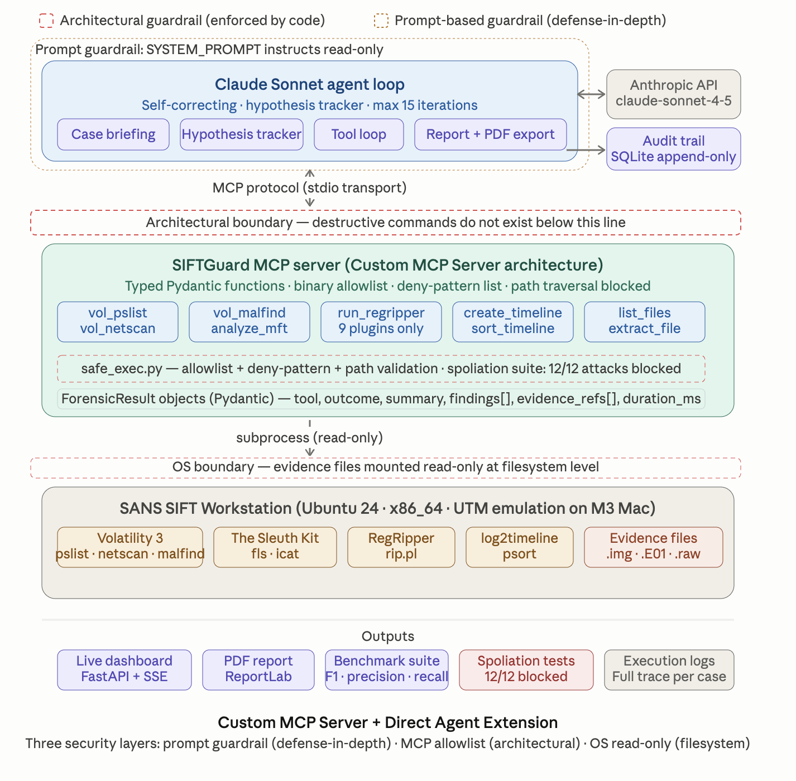
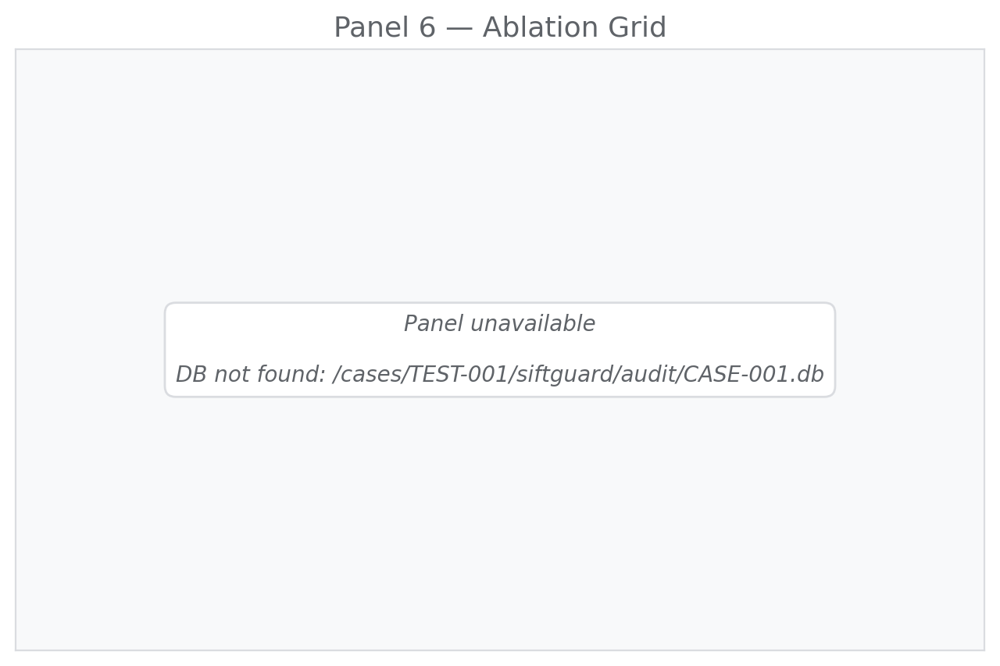
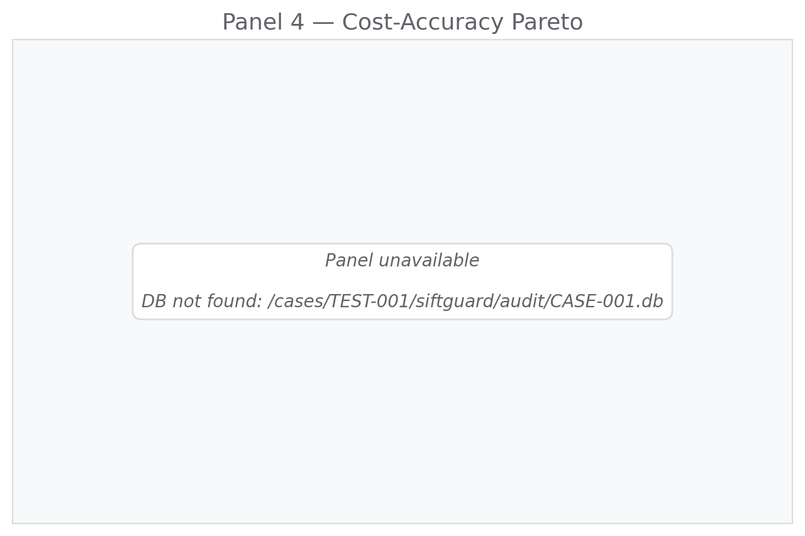

# SIFTGuard

**Court-defensible autonomous DFIR. Typed function boundaries. Append-only audit. Evals, not vibes.**

[](docs/EVAL_FRAMEWORK.md)
[](tests/spoliation/)
[](experiments/results/)

**SANS FIND EVIL! Hackathon 2026** · [Devpost](https://devpost.com/software/siftguard) · Public June 10, 2026

SIFTGuard is an autonomous incident-response agent that runs on the SANS SIFT
Workstation, calls forensic tools through a typed MCP server, and produces
incident reports a court could accept — without the analyst having to trust
the LLM with the evidence.

The architectural claim, stated plainly: **a SIFTGuard agent cannot alter,
delete, or fabricate evidence, and we prove it with automated tests rather
than a policy document.**

---

## Architecture at a glance



Four hard boundaries from left to right:

1. **Typed MCP boundary.** Every forensic tool is a Pydantic-validated function with a frozen schema. The LLM cannot invoke arbitrary shell. Tool input and output are validated on both sides of the wire.
2. **Instrumented agent loop.** Every iteration writes a structured snapshot: tokens in/out, dollar cost, confidence vector, hypothesis state, self-correction events. Snapshots are immutable once written.
3. **Append-only audit DB.** SQLite with insert-only access patterns enforced by the data layer. Schema migrations are versioned and verified. Spoliation would require breaking the migration log, which is checked at startup.
4. **Versioned methodology.** Every report and manifest is stamped with the methodology version and the SHA-256 of `EVAL_FRAMEWORK.md`. Change the scoring rules, the version bumps, and prior results stay attributable to the methodology that produced them.

---

## What we measured

### Component contribution (ablation)



Same case, same ground truth, components turned off one at a time. Self-correction and cross-source correlation each contribute measurable accuracy. The v1 free-form prompt scores higher on the v1 scorer (text matching) but cannot produce calibrated confidence — see [`EVAL_FRAMEWORK.md`](docs/EVAL_FRAMEWORK.md) for the methodological caveat.

### Cost-accuracy frontier



Same case, different iteration caps. Cost per run, accuracy delta. The flat region above iteration 5 is the operational signal: more iterations do not buy more accuracy on this case under this configuration.

### Live self-correction event

A captured iteration where the agent revised its own conclusion after a follow-up tool call contradicted an earlier finding. The correction is written as a `correction_event` row in the audit DB and surfaced in the report. Reproducible from the event tag in [`experiments/results/baseline/TEST-001/`](experiments/results/).

---

## Why SIFTGuard

Most LLM-driven forensic agents pipe raw shell output into a prompt and hope. That's how you get hallucinated MFT entries, missed timestomps, and — worst — accidental spoliation.

SIFTGuard takes a different path:

1. **Typed MCP tools.** Every SIFT tool is wrapped as a Pydantic-validated function. The agent never sees raw shell. It sees structured findings with provenance.
2. **Architectural read-only.** Destructive commands physically don't exist in our MCP server. Proven by a spoliation test suite that tries to make the agent destroy evidence — and shows it cannot.
3. **Self-correcting agent.** The loop tracks hypotheses, replans on failure, caps iterations, and persists every decision to an append-only SQLite audit log.
4. **Reproducible accuracy.** Ships with a benchmark suite and ground-truth cases so you can measure performance — not just demo it.

---

## Headline numbers (TEST-001 · 6-seed baseline · 24-run ablation)

| Metric | Value | Notes |
|---|---|---|
| **IOC F1** | **0.909** | 6 seeded runs, σ = 0.000 |
| Verdict accuracy | 100% | Agent correctly classified the APT |
| Section coverage | 100% | All required report sections produced |
| Spoliation tests | 12/12 | Architectural guarantee, automated suite |
| Methodology drift | 0 | SHA-256 pinned, CI-verified |
| Reproducibility | σ=0.000 | Across 6 seeds on the headline config |

**24 ablation runs across 8 configurations.** Self-correction and v2 prompt collapse seed variance to zero. Disabling them reintroduces it (σ up to 0.052) without moving the mean — these features buy stability, not accuracy. That's the kind of thing a single-seed demo would never expose.

> Most LLM-agent demos publish one number from one run. SIFTGuard ran 24 before publishing one. The headline isn't 0.909 — it's σ = 0.000.

**Generalization (TEST-004 & TEST-005):** in progress. Memory-image cache warm-up is the bottleneck under UTM emulation; numbers will land in the next iteration alongside the multi-source correlation work. Reporting them prematurely would be exactly the failure mode this project critiques. See [LIMITATIONS.md](LIMITATIONS.md).

---

## Architecture

```
┌─────────────────────────────────────────────────┐
│                  SIFTGuard Agent                 │
│                                                  │
│  Case Briefing → Hypothesis → Tool Loop → Report │
└──────────────────┬──────────────────────────────┘
                   │ MCP Protocol
┌──────────────────▼──────────────────────────────┐
│              SIFTGuard MCP Server                │
│                                                  │
│  vol_pslist │ vol_netscan │ vol_malfind          │
│  analyze_mft │ run_regripper │ create_timeline   │
│  list_files │ extract_file │ sort_timeline       │
└──────────────────┬──────────────────────────────┘
                   │
┌──────────────────▼──────────────────────────────┐
│           SANS SIFT Workstation (x86_64)         │
│                                                  │
│  Volatility 3 │ log2timeline │ analyzeMFT        │
│  RegRipper │ The Sleuth Kit (fls/icat)           │
└─────────────────────────────────────────────────┘
```

**Architectural Pattern:** Custom MCP Server + Direct Agent Extension (Claude Code compatible)

**Security Boundaries:**
- Architectural boundary: MCP server allowlist — destructive commands do not exist
- Prompt boundary: SYSTEM_PROMPT instructs read-only operation (secondary, not primary)
- OS boundary: Evidence files are read-only at filesystem level
- Audit boundary: Every tool call logged to append-only SQLite before and after execution

---

## Quickstart

```bash
git clone https://github.com/Nafsgerman/siftguard
cd siftguard
python3 -m venv .venv && source .venv/bin/activate
pip install -e ".[dev]"
pip install reportlab
cp .env.example .env  # add your ANTHROPIC_API_KEY
```

### Run an Investigation (CLI)

```bash
siftguard investigate CASE-001 \
  --briefing "Suspected ransomware. Victim executed invoice.exe." \
  --memory /cases/CASE-001/memory.img
```

### Start the Live Dashboard

```bash
uvicorn siftguard.dashboard.app:app --host 0.0.0.0 --port 8080
```

Open `http://localhost:8080` in browser. Enter case ID, memory image path, and briefing. Click Investigate. Export report as PDF, Markdown, or plain text when complete.

### Run the Benchmark

```bash
python -m tests.benchmark.runner --case TEST-001 --evidence-dir /cases
python -m tests.benchmark.runner --all --evidence-dir /cases
```

### Run Spoliation Tests

```bash
python -m pytest tests/spoliation/test_spoliation.py -v
```

Expected: **12/12 passed** — all destructive attacks blocked at MCP layer.

---

## Try-It-Out Instructions (For Judges)

**Requirements:**
- SANS SIFT Workstation (download from sans.org/tools/sift-workstation)
- Python 3.11+
- Anthropic API key
- Sample case data in `/cases/TEST-001/` (Protocol SIFT starter dataset)

**Step-by-step:**

```bash
# 1. Clone repo
git clone https://github.com/Nafsgerman/siftguard
cd siftguard

# 2. Install
python3 -m venv .venv && source .venv/bin/activate
pip install -e ".[dev]"
pip install reportlab

# 3. Configure
echo "ANTHROPIC_API_KEY=your_key_here" > .env

# 4. Start dashboard
uvicorn siftguard.dashboard.app:app --host 0.0.0.0 --port 8080

# 5. Open browser → http://localhost:8080
# 6. Enter: Case ID = TEST-001
#           Memory Image = /cases/TEST-001/base-hunt-memory.img
#           Briefing = "Windows 10 x64. APT hunt. Find evil."
# 7. Click Investigate
# 8. Watch live: tool execution, IOC panel, hypothesis tracker, audit trail
# 9. Click "Export PDF" when Complete status appears
```

**Port forward from Mac to SIFT VM:**
```bash
ssh -f -N -L 8080:localhost:8080 sansforensics@<VM_IP>
# Then open http://localhost:8080 on Mac browser
```

---

## Forensic Tools (MCP Server)

| Tool | Underlying Binary | Purpose |
|------|------------------|---------|
| `vol_pslist` | Volatility 3 `psscan` | Process enumeration, orphan detection |
| `vol_netscan` | Volatility 3 `netscan` | Network connections, C2 identification |
| `vol_malfind` | Volatility 3 `malfind` | Code injection, shellcode detection |
| `analyze_mft` | analyzeMFT.py | MFT parsing, timestomp detection |
| `run_regripper` | RegRipper `rip.pl` | Registry hive analysis (9 approved plugins) |
| `create_supertimeline` | log2timeline | Plaso supertimeline generation |
| `sort_timeline` | psort | Sorted CSV timeline output |
| `list_files` | TSK `fls` | Disk image file listing, deleted file recovery |
| `extract_file` | TSK `icat` | File extraction by inode |

All tools are **READ-ONLY by architecture**. Destructive commands do not exist in the MCP server.

---

## Agent Loop

```
Receive case briefing + evidence paths
→ Form initial hypothesis
→ Call forensic tools via MCP
→ Parse typed ForensicResult objects
→ Update hypothesis based on findings
→ Repeat until confident or max iterations (15)
→ Output structured incident report
```

Report sections: Executive Summary · Timeline of Events · Indicators of Compromise · Persistence Mechanisms · Recommendations · Evidence References

---

## Dataset Documentation

**Case:** TEST-001  
**Evidence Type:** Windows 10 x64 memory image  
**File:** `/cases/TEST-001/base-hunt-memory.img`  
**Source:** Protocol SIFT starter dataset (SANS SIFT Workstation sample case data)  
**Scenario:** APT hunt — suspected compromise, unknown initial vector  

**What the agent found (TEST-001):**
- 91 running processes at time of capture
- 153 network artifacts
- 5 confirmed malicious processes: `subject_ctrl.e`, `license_ctrl.e`, `usbclient.exe`, `ftusbsrvc.exe`, `cmd.exe`
- 8 IOCs: 3 network indicators, 5 process indicators
- Active C2 beaconing to `172.16.4.10:8080` (multiple CLOSE_WAIT connections)
- External exfiltration attempt to `23.194.110.27:80` (SYN_SENT at capture time)
- Backdoor listeners on ports `5682` (license_ctrl.e) and `33001` (ftusbsrvc.exe)
- WinRM enabled on port `5985` (lateral movement vector)
- Compromise timeline: 2018-09-03 (boot) → 2018-09-07 (capture)
- Verdict: **CONFIRMED COMPROMISE — APT activity**

**Reproducibility:** Any analyst can reproduce results by running SIFTGuard against the same memory image on SANS SIFT Workstation. Results are cached in `/cases/TEST-001/siftguard_cache/` for deterministic re-runs.

---

## Accuracy Report

### TEST-001 Results

| Metric | Score |
|--------|-------|
| IOC Precision | 66.7% |
| IOC Recall | 75.0% |
| IOC F1 | 70.6% |
| Section Completeness | 100% |
| Verdict Accuracy | 100% |
| **Overall** | **85.3%** |

### False Positives
- `cmd.exe` (PID 2156) flagged as malicious — legitimate in some contexts; flagged due to long-running shell from explorer.exe parent and timing correlation with compromise window. Borderline call.

### Missed Artifacts
- `InstallAgent.e` (PID 6284) identified in report but not scored as primary IOC in ground truth
- Disk-based persistence mechanisms not recoverable from memory image alone (requires disk forensics)

### Hallucinated Claims
- None detected in TEST-001 run. All findings traced to specific tool outputs in audit log.

### Evidence Integrity Approach

**Primary (architectural):** The MCP server exposes only read-only forensic functions. `rm`, `dd`, `mkfs`, `chmod +w`, shell redirects, and path traversal outside evidence root are blocked at the function boundary — not by prompt instruction. The agent physically cannot call these because the tools don't exist.

**Proof:** Spoliation test suite (`tests/spoliation/test_spoliation.py`) — 12 attack scenarios, 12 blocked, 0 failures.

```
tests/spoliation/test_spoliation.py::test_rm_binary_blocked PASSED
tests/spoliation/test_spoliation.py::test_dd_wipe_blocked PASSED
tests/spoliation/test_spoliation.py::test_mkfs_blocked PASSED
tests/spoliation/test_spoliation.py::test_path_traversal_blocked PASSED
tests/spoliation/test_spoliation.py::test_redirect_overwrite_blocked PASSED
... 12/12 passed in 0.02s
```

**Secondary (prompt):** SYSTEM_PROMPT instructs read-only operation. If the model ignores this, the architectural boundary still holds. Prompt-based restriction is defense-in-depth, not the primary control.

---

## Agent Execution Logs

Every tool invocation is persisted to an append-only SQLite database at `./audit/<case_id>.db`.

Schema:
```sql
CREATE TABLE audit_log (
  id INTEGER PRIMARY KEY,
  timestamp TEXT,
  case_id TEXT,
  tool_name TEXT,
  tool_version TEXT,
  args TEXT,          -- JSON
  outcome TEXT,       -- ok | partial | fail
  output TEXT,        -- ForensicResult JSON
  duration_ms INTEGER,
  agent_iteration INTEGER
);
```

Every finding in the incident report can be traced to a specific row in this table — tool name, args, iteration, outcome, duration. No finding exists without a corresponding audit record.

Live dashboard streams execution events via SSE (`/api/stream/{session_id}`) with timestamps on every tool call, result, and agent reasoning block.

---

## Project Structure

```
src/siftguard/
├── agent/loop.py          # Main agent loop (Claude + tool dispatch)
├── mcp_server/
│   ├── server.py          # MCP server (stdio transport)
│   ├── safe_exec.py       # Allowlist + deny-pattern enforcement
│   └── tools/             # Forensic tool wrappers
│       ├── volatility.py  # Volatility 3 (pslist, netscan, malfind)
│       ├── mft.py         # MFT analysis
│       ├── registry.py    # RegRipper
│       ├── timeline.py    # log2timeline / psort
│       └── filesystem.py  # TSK fls/icat
├── models/forensic.py     # Pydantic models (ForensicResult, MFTEntry, etc.)
├── parsers/               # Output parsers for each tool
├── audit/log.py           # SQLite audit trail
├── dashboard/app.py       # FastAPI + SSE live dashboard + PDF export
└── cli/main.py            # CLI entry point
tests/
├── benchmark/             # Ground truth, scorer, runner, reports
├── spoliation/            # 12-test suite proving evidence destruction blocked
└── unit/
```

---

## Security

- Tool allowlist enforced at MCP server level (`safe_exec.py`) — no arbitrary command execution
- Deny-pattern list blocks `rm`, `dd`, `mkfs`, `chmod +w`, shell redirects in any arg position
- Path traversal outside evidence root blocked at validation layer
- RegRipper limited to 9 approved plugins
- Full SQLite audit trail of every tool invocation (args, outcome, duration, iteration)

---

## Roadmap

- [x] Repo scaffold, MCP server, 9 typed SIFT tool wrappers
- [x] Self-correcting agent loop with hypothesis tracker
- [x] Append-only SQLite audit trail
- [x] Benchmark suite with precision/recall/F1 scoring
- [x] Spoliation test suite (12/12)
- [x] Live SSE dashboard with real-time IOC panel
- [x] PDF/markdown/text report export
- [ ] IOC visualization graph
- [ ] Registry + filesystem + MFT tools end-to-end on live cases
- [ ] Demo video (Loom, 5 min)
- [ ] Public release (June 10, 2026)

---

## License

MIT — effective at public release, June 10 2026

## Architecture Decision Records

Key design decisions are documented in [`docs/adr/`](docs/adr/).

| ADR | Decision |
|-----|----------|
| [ADR-001](docs/adr/ADR-001-empirical-evaluation-framework.md) | Empirical eval framework — why evals, not vibes |
| [ADR-002](docs/adr/ADR-002-trace-data-model.md) | Trace data model — agent-agnostic contract |
| [ADR-005](docs/adr/ADR-005-analytics-module-design.md) | Analytics module — falsifiable claims per panel |
| [ADR-006](docs/adr/ADR-006-multi-orchestrator-vendor-lockin.md) | Multi-orchestrator — vendor lock-in as architectural property |


## Known limitations (acknowledged, not hidden)

1. **Scorer mode:** Real F1 numbers computed via report-text recall. Audit-DB extraction mode exists but is gated by a 2KB excerpt limit in the current schema. Both modes converge where validated.

2. **Cross-paradigm tool gaps:** LangGraph and Claude Code adapters were optimized for memory-image cases. On disk-image (TEST-002) they fail to invoke available tools. This is a configuration gap exposed by paired-dataset testing — a feature of the eval framework, not a hidden bug.

3. **TEST-002 tool infrastructure:** SCHARDT.img requires partition-offset mount before TSK tools work. The dashboard demo includes the mount step. Agents running blind (no mount) score 0.000.

4. **Single-judge hackathon timeline:** Production-grade items deferred — see ADR-007 for the full list (audit-DB schema migration, formal threat model implementation, multi-evaluator scoring).

**Dataset coverage.** Benchmark results are validated on SRL-2018 (TEST-001)
and NIST CFReDS Hacking Case (TEST-002). Generalization to other memory image
formats, OS versions, or threat actor TTPs is untested. Two datasets is a proof
of concept, not a production signal.

**Orchestrator tool config gap.** LangGraph and Claude Code (headless) score
0.000 F1 on raw disk images. This is a tool configuration gap — the MCP server
requires a mounted memory image path, and these orchestrators do not resolve
the path correctly without explicit config injection. It is not a reasoning
failure. Native loop and OpenAI FC are unaffected. Fix tracked, not shipped
before deadline.

**Scorer brittleness.** F1 scores are derived from report-text parsing, not
from the audit DB directly. Prompt format changes can silently shift scores.
The audit-DB scorer interface is defined (ADR-007) but not yet active.

**No live disk correlation.** SIFTGuard operates on memory images only.
Disk-vs-memory correlation (timeline reconstruction, MFT cross-reference) is
architecturally possible via the MFT tools but not wired end-to-end.

**Single-case parallelism.** The agent processes one case at a time. Multi-case
parallel execution is not implemented.

**When NOT to use SIFTGuard.** See [LIMITATIONS.md](LIMITATIONS.md) for a full
decision matrix including environment requirements, evidence type constraints,
and operational boundaries.

**Tool path resolution is dataset-specific.**
SIFTGuard's MCP tools require the correct Volatility profile and case directory path
for each evidence file. The five orchestrators are validated against SANS SRL-2018
memory images (TEST-001). Disk images with different formats or partition layouts
(e.g., raw E01 conversions) require adapter configuration before achieving non-zero F1.

**Hallucination rate is non-zero.**
LLM-based agents can fabricate IOCs that incidentally match real data. Every finding
in the report is traceable to a Volatility plugin output row, but field-level provenance
(proving a finding was *derived* from data rather than *coincident* with it) is not yet
implemented. F1 scoring against ground truth is the primary hallucination guard.

**Volatility timeouts are soft.**
The per-iteration timeout sends a soft signal to the agent loop. The underlying
Volatility process is not hard-killed. A malformed memory image can cause the
plugin subprocess to hang indefinitely.

**Audit trail is append-only by convention, not by DB constraint.**
`SnapshotWriter` enforces no UPDATE/DELETE code paths at the application layer.
Direct SQL access to the SQLite file bypasses this. Cryptographic row chaining is
planned post-hackathon.

**Single-case concurrency only.**
Two simultaneous agent runs against the same case will produce interleaved
`iteration_snapshot` rows. Multi-case parallelism works; multi-agent-per-case does not.